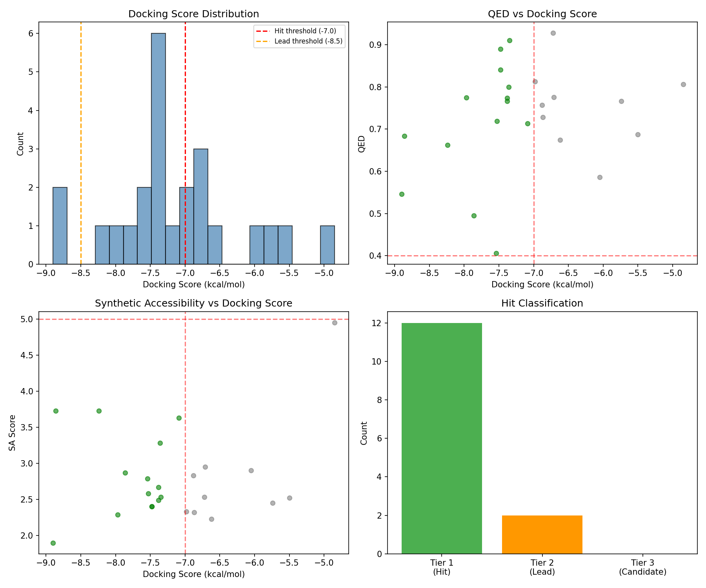

# KRAS G12C Inhibitor Discovery — Autonomous Agent Results

## Status

| Metric | Value |
|--------|-------|
| Total molecules evaluated | 28 |
| Total hits (pass all criteria) | 14 |
| Tier 1 hits | 12 |
| Tier 2 leads | 2 |
| Tier 3 candidates | 0 |
| Best docking score | -8.90 kcal/mol |
| Sotorasib calibration | -8.17 kcal/mol (PASS) |

## Top Molecules

| Rank | SMILES | Docking (kcal/mol) | QED | SA | Novelty (Tanimoto) | Tier |
|------|--------|--------------------|-----|----|--------------------|------|
| 1 | `O=c1cc(-c2ccc(-c3ccccn3)cc2)oc2ccccc12` | -8.90 | 0.546 | 1.90 | 0.069 | 2 |
| 2 | `COc1ccc2ccnc(nc(C3CCOCC3)cc1)Nc1cccc(F)c1-2` | -8.86 | 0.684 | 3.73 | 0.124 | 2 |
| 3 | `c1cncc(OC2CNCCN2Nc2cnc3[nH]ccc3n2)c1` | -8.24 | 0.662 | 3.73 | 0.096 | 1 |
| 4 | `O=C(c1cc2ccccc2[nH]1)C1CCNCC1` | -7.97 | 0.775 | 2.29 | 0.104 | 1 |
| 5 | `Nc1ncc(CNc2nc(Cc3cnc(N)s3)c3ccccc3n2)s1` | -7.86 | 0.495 | 2.87 | 0.065 | 1 |
| 6 | `Nc1ncc(CNC(=O)Nc2nc3ccccc3n2Cc2cnc(N)s2)s1` | -7.54 | 0.406 | 2.79 | 0.120 | 1 |
| 7 | `Clc1ccc(-c2cnn3c(C4CCOCC4)nccc23)cc1` | -7.53 | 0.719 | 2.58 | 0.117 | 1 |
| 8 | `CNC(=O)n1nc(N2CCN(C)CC2)c2ccccc21` | -7.48 | 0.841 | 2.40 | 0.143 | 1 |
| 9 | `CN1CCC(c2nc(NCC(N)=O)nc3ccccc23)CC1` | -7.48 | 0.890 | 2.40 | 0.144 | 1 |
| 10 | `c1ccc2c(c1)c(-c1ccncc1)nn2N1CCNCC1` | -7.38 | 0.774 | 2.67 | 0.068 | 1 |

## SAR Analysis (Batch 1)

### Key findings:
1. **Chromone/flavone scaffold** (`O=c1cc(...)oc2ccccc12`) achieves best docking score (-8.90) — the flat aromatic system fits well in the shallow switch-II pocket
2. **Naphthyridine-fluorophenyl** combination (-8.86) shows strong binding, leveraging both hydrophobic and H-bond interactions
3. **Indole-piperidine** motif (-7.97) is highly drug-like (QED=0.775, SA=2.29) — excellent lead-like profile
4. **Pyridine and pyrimidine rings** consistently appear in top hits, providing H-bond acceptors for K16/D69 interactions
5. **Piperazine/piperidine** groups are common in hits, providing solubility handles and basic nitrogen for salt bridge

### Structural features correlating with good docking:
- Fused bicyclic aromatic cores (quinazoline, indazole, benzimidazole)
- Pyridyl/pyrimidinyl groups as H-bond acceptors
- Saturated nitrogen-containing rings (piperidine, piperazine, morpholine)
- Fluorine substituents on aryl rings
- Molecular weight 250-400 Da sweet spot

### Failure modes:
- Small fragments (MW < 200) dock weakly (> -5 kcal/mol)
- Highly flexible molecules dock poorly — rigidity helps pocket fitting
- Very polar molecules (high TPSA) lose hydrophobic complementarity

## Property Distributions

## Strategy

**Current approach:** Template-based generation using KRAS G12C pharmacophore patterns + scaffold hopping + fragment combination. Next batches will incorporate genetic optimization from top hits.

**Next steps:**
- Mutate and crossover top Tier 1/2 hits to optimize binding
- Explore larger aromatic systems for deeper pocket penetration
- Test bioisosteric replacements on best scaffolds
- Target Tier 3 candidates (< -10 kcal/mol)

---
*Generated autonomously by Claude drug discovery agent*
*Last updated: Batch 1*
